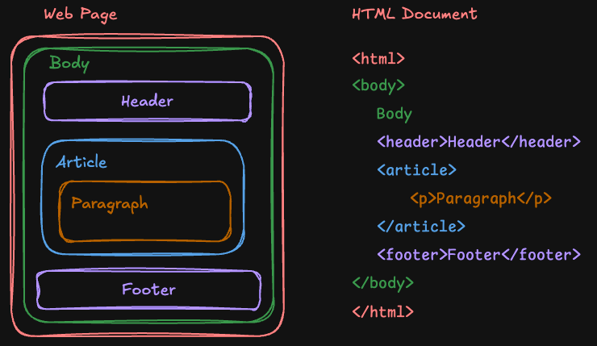
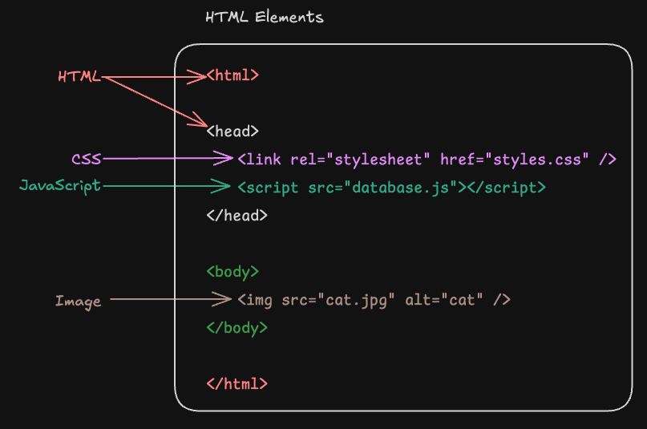

# Module 1

## What is a Web Page?
A web page is a document that can be displayed in a [web browser](https://developer.mozilla.org/en-US/docs/Glossary/Browser). It is written using web technologies such as [HTML](https://developer.mozilla.org/en-US/docs/Web/HTML), [CSS](https://developer.mozilla.org/en-US/docs/Web/CSS), and [JavaScript](https://developer.mozilla.org/en-US/docs/Web/JavaScript).

A webpage serves two main purposes:
1. **Displays information** to users.
2. **Describes** how that information is organized.

[](./art/page_document_comparison.png)

The information on a webpage is presented using different types of [elements](https://developer.mozilla.org/en-US/docs/Web/HTML/Element). 

These elements include:
- [HTML](https://developer.mozilla.org/en-US/docs/Web/HTML) code that creates the structure and content
- [CSS](https://developer.mozilla.org/en-US/docs/Web/CSS) (Cascading Style Sheets) that controls the appearance and layout
- [JavaScript](https://developer.mozilla.org/en-US/docs/Web/JavaScript) that adds interactivity and dynamic features
- Media elements like [images](https://developer.mozilla.org/en-US/docs/Web/HTML/Element/img), [videos](https://developer.mozilla.org/en-US/docs/Web/HTML/Element/video), and [audio](https://developer.mozilla.org/en-US/docs/Web/HTML/Element/audio)

[](./art/html_elements.png)

When you visit a website, your browser requests these files from a web [server](https://en.wikipedia.org/wiki/Server_(computing)), interprets the code, and renders the visual page you see on your screen. 

Web pages can be simple static documents or complex interactive applications. 

They're connected to other pages through [hyperlinks](https://developer.mozilla.org/en-US/docs/Learn_web_development/Howto/Web_mechanics/What_are_hyperlinks), forming the interconnected "web" that gives the [World Wide Web](https://developer.mozilla.org/en-US/docs/Glossary/World_Wide_Web) its name.

## HTML: HyperText Markup Language

From [MDN](https://developer.mozilla.org/en-US/docs/Web/HTML)

> HTML (HyperText Markup Language) is the most basic building block of the Web. It defines the meaning and structure of web content.

### Basic Structure of an HTML Document
An HTML document is made up of a series of [elements](https://developer.mozilla.org/en-US/docs/Web/HTML/Element) that define its content and structure. Here is a simple example of an HTML document:

```html
<!DOCTYPE html>
<html lang="en">
<head>
    <meta charset="UTF-8">
    <meta name="viewport" content="width=device-width, initial-scale=1.0">
    <title>My First Webpage</title>
</head>
<body>
    <h1>Welcome to My Webpage</h1>
    <p>This is a paragraph explaining what my webpage is about.</p>
    <a href="https://developer.mozilla.org/en-US/docs/Web/HTML">Learn more about HTML</a>
</body>
</html>
```

**What Does it Mean?**
- The [`<!DOCTYPE html>`](https://developer.mozilla.org/en-US/docs/Glossary/HTML5) declares the document type as HTML5.
- The [`<html>`](https://developer.mozilla.org/en-US/docs/Web/HTML/Element/html) element that contains all the content of the webpage.
- The [`<head>`](https://developer.mozilla.org/en-US/docs/Web/HTML/Element/head) element contains metadata, such as the title and character set.
- The [`<title>`](https://developer.mozilla.org/en-US/docs/Web/HTML/Element/title) sets the title displayed on the browser tab.
- The [`<body>`](https://developer.mozilla.org/en-US/docs/Web/HTML/Element/body) Contains the visible content of the webpage, such as [headings](https://developer.mozilla.org/en-US/docs/Web/HTML/Element/Heading_Elements), [paragraphs](https://developer.mozilla.org/en-US/docs/Web/HTML/Element/p), and [links](https://developer.mozilla.org/en-US/docs/Web/HTML/Element/a).

### Common HTML Elements

Here are some basic HTML elements you will frequently use:
- [Headings](https://developer.mozilla.org/en-US/docs/Web/HTML/Element/Heading_Elements): `<h1>` to `<h6>` define headings, with `<h1>` being the most important.
- [Paragraphs](https://developer.mozilla.org/en-US/docs/Web/HTML/Element/p): `<p>` for text content.
- [Links](https://developer.mozilla.org/en-US/docs/Web/HTML/Element/a): `<a href="url">` for [hyperlinks](https://developer.mozilla.org/en-US/docs/Learn_web_development/Howto/Web_mechanics/What_are_hyperlinks).
- [Images](https://developer.mozilla.org/en-US/docs/Web/HTML/Element/img): `` for displaying images.
- [Lists](https://developer.mozilla.org/en-US/docs/Learn_web_development/Core/Structuring_content/Lists):
    - [Ordered](https://developer.mozilla.org/en-US/docs/Web/HTML/Element/ol): `<ol>` and `<li>` for numbered lists.
    - [Unordered](https://developer.mozilla.org/en-US/docs/Web/HTML/Element/ul): `<ul>` and `<li>` for bullet lists.

### HTML Attributes
HTML elements can have attributes that provide additional information. For example:

```html
<a href="https://example.com" target="_blank" title="Visit Example">Visit Example</a>
```
In this example:
- `href` defines the link’s destination.
- `target="_blank"` opens the link in a new tab.
- `title` displays a tooltip when the user hovers over the link.

## Resources

- [HTML](https://developer.mozilla.org/en-US/docs/Web/HTML)
- [HTML Crash Course](https://www.youtube.com/watch?v=916GWv2Qs08&pp=ygURaHRtbCBjcmFzaCBjb3Vyc2U%3D)
- [FreeCodeCamp](https://www.freecodecamp.org/)
    - [Full Stack Developer](https://www.freecodecamp.org/learn/full-stack-developer/)