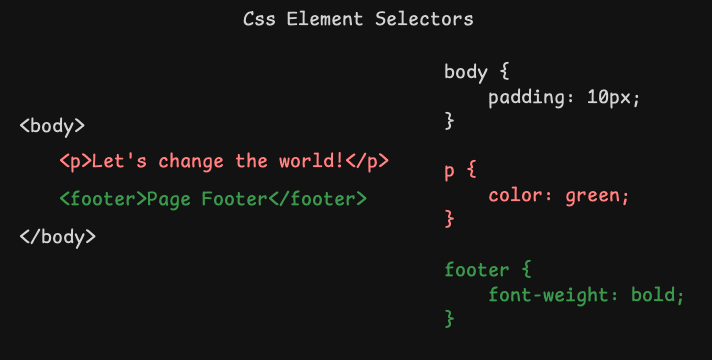
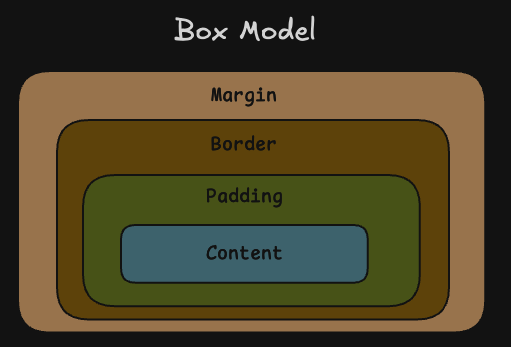

# Module 2 CSS

## What is CSS?

[CSS](https://developer.mozilla.org/en-US/docs/Web/CSS) (Cascading Style Sheets) is a language used to **describe** the **presentation** of a web page, including colors, layout, and fonts. 

It allows you to separate the content of a web page (written in HTML) from its visual presentation, making it easier to maintain and style websites consistently.

## What Does it Look Like?

A CSS rule is made up of [selectors](https://developer.mozilla.org/en-US/docs/Learn_web_development/Core/Styling_basics/Basic_selectors) and properties.

This is the format:

```css
selector {
    property: value;
}
```

Example:

```css
h1 {
    color: blue;
    font-size: 24px;
}
```

What Does it Mean?
- The selector (`h1`) specifies all `<h1></h1>` HTML elements to style.
- The property (`color`) is the aspect to style, and the value (`blue`) defines how to style it.

## How Does CSS Select HTML Elements?

You can select elements directly by using the element name in the CSS rule:
```html
<p>Let's change the world!</p>
```

```css
p { 
    color: green; 
}
```

[](./art/css_element_selectors.png)

### Class Selectors
Selects elements with a specific class.
```html
<p class="highlight">Let's change the world!</p>
```
```css
.highlight { 
    background-color: yellow; 
}
```

### ID Selectors
Selects a single element with a specific ID.
```html
<p id="main-paragraph">Let's change the world!</p>
```
```css
#main-paragraph { 
    background-color: yellow; 
}
```

## CSS Box Model

Every HTML element is a box that consists of:
- Content: The text or images inside the element.
- Padding: Space between the content and the border.
- Border: A line surrounding the padding and content.
- Margin: Space outside the border.
```css
p { 
    padding: 10px;
    border: 2px solid pink;
    margin: 20px; 
}
```
[](./art/box_model.png)

## Examples

Here is a list of properties for a paragraph:
```css
p {
    /* Text Properties */
    color: #333;                       /* Sets text color */
    font-size: 16px;                   /* Sets text size */
    font-family: Arial, sans-serif;    /* Sets font type */
    font-weight: bold;                 /* Sets text boldness */
    font-style: italic;                /* Sets italic style */
    font-variant: small-caps;          /* Sets small-caps style */
    font-stretch: expanded;            /* Stretches text horizontally */
    text-align: justify;               /* Aligns text to justify */
    text-decoration: underline;        /* Underlines text */
    text-transform: uppercase;         /* Converts text to uppercase */
    text-shadow: 2px 2px #aaa;        /* Adds shadow to text */
    letter-spacing: 1px;               /* Adjusts letter spacing */
    word-spacing: 2px;                 /* Adjusts word spacing */
    line-height: 1.5;                  /* Sets line spacing */
    text-indent: 20px;                 /* Indents first line */
    white-space: nowrap;               /* Prevents text wrapping */
    direction: rtl;                    /* Sets text direction (right-to-left) */
    unicode-bidi: embed;               /* Controls text direction in mixed languages */

    /* Background Properties */
    background-color: #f0f0f0;         /* Sets background color */
    background-image: url('image.jpg'); /* Adds a background image */
    background-size: cover;            /* Sets background size */
    background-repeat: no-repeat;      /* Prevents background repetition */
    background-position: center;       /* Centers background image */
    background-attachment: fixed;      /* Fixes background during scroll */
    background-blend-mode: multiply;   /* Blends background layers */

    /* Border Properties */
    border: 1px solid #000;            /* Adds a border */
    border-radius: 5px;                /* Rounds border corners */
    border-width: 2px;                 /* Sets border width */
    border-color: #444;                /* Sets border color */
    border-style: dashed;              /* Sets border style */

    /* Box Model Properties */
    padding: 10px;                    /* Sets inner spacing */
    margin: 20px;                     /* Sets outer spacing */
    box-shadow: 2px 2px 5px #888;    /* Adds shadow effect */
    box-sizing: border-box;            /* Includes border in width and height */

    /* List Properties */
    list-style-type: square;           /* Sets list item marker type */
    list-style-image: url('marker.png');/* Custom list item marker */

    /* Display and Visibility */
    display: block;                    /* Sets display type */
    visibility: visible;               /* Controls visibility */
    opacity: 0.9;                      /* Sets element opacity */
    z-index: 10;                       /* Sets stacking order */

    /* Positioning */
    position: relative;                /* Sets positioning method */
    top: 10px;                         /* Adjusts vertical position */
    left: 5px;                         /* Adjusts horizontal position */
    float: left;                       /* Floats element to the left */
    clear: both;                       /* Prevents floating elements */

    /* Flexbox Properties */
    display: flex;                     /* Sets flex container */
    flex-direction: column;            /* Stacks children vertically */
    justify-content: center;           /* Aligns children vertically */
    align-items: center;               /* Aligns children horizontally */

    /* Grid Properties */
    display: grid;                     /* Sets grid container */
    grid-template-columns: 1fr 2fr;    /* Defines column sizes */
    grid-gap: 10px;                    /* Sets gap between grid items */

    /* Animation and Transition */
    transition: all 0.3s ease-in-out;  /* Adds smooth transitions */
    animation: fadeIn 2s ease-in;      /* Adds animations */

    /* Overflow */
    overflow: hidden;                  /* Hides overflow content */
    overflow-x: scroll;                /* Adds horizontal scroll */
    overflow-y: auto;                  /* Adds vertical scroll */

    /* Cursor */
    cursor: pointer;                   /* Changes cursor on hover */

    /* Filter and Effects */
    filter: grayscale(50%);            /* Applies grayscale filter */
    backdrop-filter: blur(5px);        /* Applies blur effect to background */

    /* Custom Variables */
    --main-color: #3498db;             /* Defines custom variable */
    color: var(--main-color);          /* Uses custom variable */

    /* Print Properties */
    page-break-before: always;         /* Forces page break in print */
    page-break-inside: avoid;          /* Prevents page break inside element */

    /* Media Queries */
    @media (max-width: 600px) {
        font-size: 14px;               /* Adjusts text size on small screens */
    }
}
```