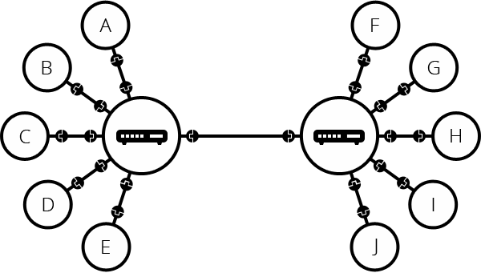

# Module 7 How the Internet Works

## Overview 

The Internet is the backbone of the Web, the technical infrastructure that makes the Web possible.
At its most basic, the Internet is a large network of computers which communicate all together.

Back in 1989, Tim Berners-Lee, the Web's inventor, spoke of the three pillars on which the Web stands:

- [URL](https://developer.mozilla.org/en-US/docs/Glossary/URL), an address system that keeps track of Web documents
- [HTTP](https://developer.mozilla.org/en-US/docs/Glossary/HTTP), a transfer protocol to find documents when given their URLs
- [HTML](https://developer.mozilla.org/en-US/docs/Glossary/HTML), a document format allowing for embedded hyperlinks

## How Computers Communicate

> When two computers need to communicate, you have to link them, either physically (usually with an Ethernet cable) or wirelessly (for example with
> Wi-Fi or Bluetooth systems). All modern computers can sustain any of those connections.

[](./art/internet-schema-1.png)

> Such a network is not limited to two computers. You can connect as many computers as you wish. But it gets complicated quickly. If you're trying to
> connect, say, ten computers, you need 45 cables, with nine plugs per computer!

[](./art/internet-schema-2.png)

> To solve this problem, each computer on a network is connected to a special tiny computer called a network switch (or switch for short). This switch
> has only one job: like a signaler at a railway station, it makes sure that messages sent from a given computer arrive only at their target
> destination
> computer. To send a message to computer B, computer A sends the message to the switch, which in turn forwards the message to computer B — computer B
> doesn't get messages intended for other computers, and none of the messages for computer B reach other computers on the local area network.
>
> Once we add a switch to the system, our network of 10 computers only requires 10 cables: a single plug for each computer and a switch with 10 plugs.

[](./art/internet-schema-3.png)

> So far so good. But what about connecting hundreds, thousands, billions of computers? Of course a single switch can't scale that far, but, if you
> read carefully, we said that a switch is a computer like any other, so what keeps us from connecting two switches together? Nothing, so let's do
> that.

[](./art/internet-schema-4.png)

> You may imagine that we can connect switches together infinitely, to form a network like this:

[](./art/internet-schema-5.png)

> In reality, this leads to many engineering problems. The more switches a packet has to go through, the longer it takes to reach its destination. And
> you can't have just a tree of switches, because then a single switch failure may disconnect a large portion of devices. To solve this problem, we
> keep
> each local network as small as possible, and we connect these local networks using a separate device called a router. A router is a computer that
> knows how to forward messages between networks. The router is like a post office: when a packet arrives, it reads the recipient address and forwards
> the packet to the right recipient directly, without going through layers of relays.
>
> Such a network comes very close to what we call the Internet. We just need the physical medium (cables) to connect all these routers. Luckily, such
> an
> infrastructure already existed prior to the Internet, and that's the telephone network. To connect our network to the telephone infrastructure, we
> need a special piece of equipment called a modem. This modem turns the information from our network into information manageable by the telephone
> infrastructure and vice versa.

[](./art/internet-schema-6.png)

> Note that the commercial router in your home is likely a combination of a switch, a router, and a modem, all in one device.
>
> So we are connected to the telephone infrastructure. The next step is to send the messages from our network to the network we want to reach. To do
> that, we will connect our network to an Internet Service Provider (ISP). An ISP is a company that manages some special routers that are all linked
> together and can also access other ISPs' routers. So the message from our network is carried through the network of ISP networks to the destination
> network. The Internet consists of this whole infrastructure of networks.

[](./art/internet-schema-7.png)

### IP Addresses

Every device on the internet has a unique IP (Internet Protocol) address, like:

- IPv4: `192.168.1.1`
- IPv6: `2001:0db8:85a3:0000:0000:8a2e:0370:7334`

Think of IP addresses as the postal addresses of the internet - they help data find its way to the right destination.

### Domain Name System (DNS)

DNS translates human-readable domain names into IP addresses:

1. You type: `www.example.com`
2. DNS server translates to: `93.184.216.34`
3. Your browser connects to that IP

It's like a phone book for the internet - translating names into numbers.

## Links

Hyperlinks, usually called links, are a foundational concept behind the Web. 

A link is a text string tied to a URL and we use links to allow easy jumping from one document to another.

There are three types of links:
- **Internal links**: A link between two webpages, where both webpages belong to the same website, is called an internal link. Without internal links, there's no such thing as a website (unless, of course, it's a one-page website).
- **External links**: A link from your webpage to someone else's webpage. Without external links, there is no Web, since the Web is a network of webpages. Use external links to provide information besides the content available through your webpage.
- **Incoming links**: A link from someone else's webpage to your site. It's the opposite of an external link. Note that you don't have to link back when someone links to your site.

## Request/Response Cycle

When you visit a website:

1. **Request**: Your browser sends an HTTP request:

```http
GET /index.html HTTP/1.1
Host: www.example.com
User-Agent: Mozilla/5.0
Accept: text/html
```

2. **Response**: The server sends back:

```http
HTTP/1.1 200 OK
Content-Type: text/html
Content-Length: 1234

<!DOCTYPE html>
<html>...
```

## HTTP Methods

Common ways to interact with web servers:

- `GET`: Request data
- `POST`: Submit data
- `PUT`: Update data
- `DELETE`: Remove data

## HTTP Status Codes

Server responses include status codes:

- `200`: OK
- `404`: Not Found
- `500`: Server Error
- `301`: Moved Permanently
- `403`: Forbidden

## Client-Server Model

1. **Client** (Your Browser):
    - Sends requests
    - Renders responses
    - Handles user interaction

2. **Server**:
    - Listens for requests
    - Processes data
    - Sends responses
    - Manages resources

## TCP/IP Protocol

The internet uses a layered protocol stack:

1. **Application Layer** (HTTP, FTP, SMTP)
    - Handles specific application protocols

2. **Transport Layer** (TCP, UDP)
    - Manages data transmission
    - Ensures reliability

3. **Internet Layer** (IP)
    - Routes packets between networks

4. **Network Access Layer**
    - Handles physical transmission

## HTTPS and Security

Secure version of HTTP:

- Uses SSL/TLS encryption
- Protects data in transit
- Shows 🔒 in browser
- Required for sensitive data

## Cookies and Sessions

Ways servers remember clients:

```http
Set-Cookie: sessionId=abc123; Expires=Wed, 09 Jun 2024 10:18:14 GMT
```

Used for:

- User authentication
- Shopping carts
- Preferences
- Tracking

## Content Delivery Networks (CDN)

Distributed servers that:

- Cache content globally
- Reduce load times
- Handle high traffic
- Prevent outages

## API Communication

Modern web apps use APIs:

```javascript
fetch('https://api.example.com/data')
    .then(response => response.json())
    .then(data => console.log(data));
```

## Common Issues

1. **Latency**:
    - Time for data to travel
    - Affected by distance
    - Network congestion

2. **Bandwidth**:
    - Data transfer capacity
    - Limited by infrastructure
    - Affects loading speed

3. **Security**:
    - DDoS attacks
    - Man-in-the-middle
    - Data breaches

## Resources

- [MDN Web Docs - How the Internet Works](https://developer.mozilla.org/en-US/docs/Learn/Common_questions/How_does_the_Internet_work)
- [HTTP Status Codes](https://httpstatuses.com/)
- [What is DNS?](https://www.cloudflare.com/learning/dns/what-is-dns/)
